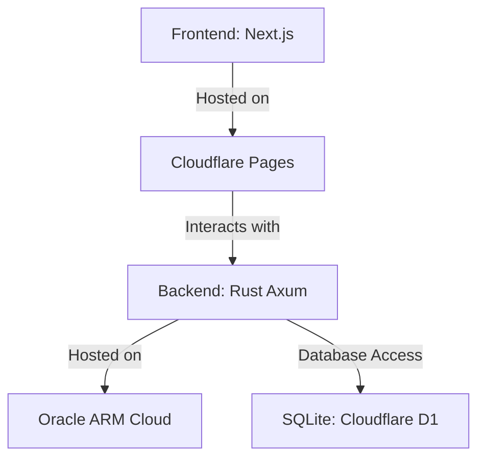

## Introduction
Welcome to the InvestUtil project repository. This repository contains information about my site, which I plan to partially open-source. The project aims to provide a comprehensive investment utility platform. For the initial setup and development, I plan to use this guide.

## Domain Name
investutil.com

## Tech Stack

### Frontend

- Framework: Next.js
- Hosting: Cloudflare Pages
  
### Backend
- Framework: Rust Axum
- Hosting: Oracle ARM Cloud
### Database
- Type: SQLite
- Service: Cloudflare D1
- 
### Deployment
The deployment process for the InvestUtil project involves using Cloudflare Pages for the frontend, Oracle ARM Cloud for the backend, and Cloudflare D1 for the database. This section will be updated with detailed deployment instructions as the project progresses.

### Diagram
Below is a diagram illustrating the architecture and tech stack of the InvestUtil project:

