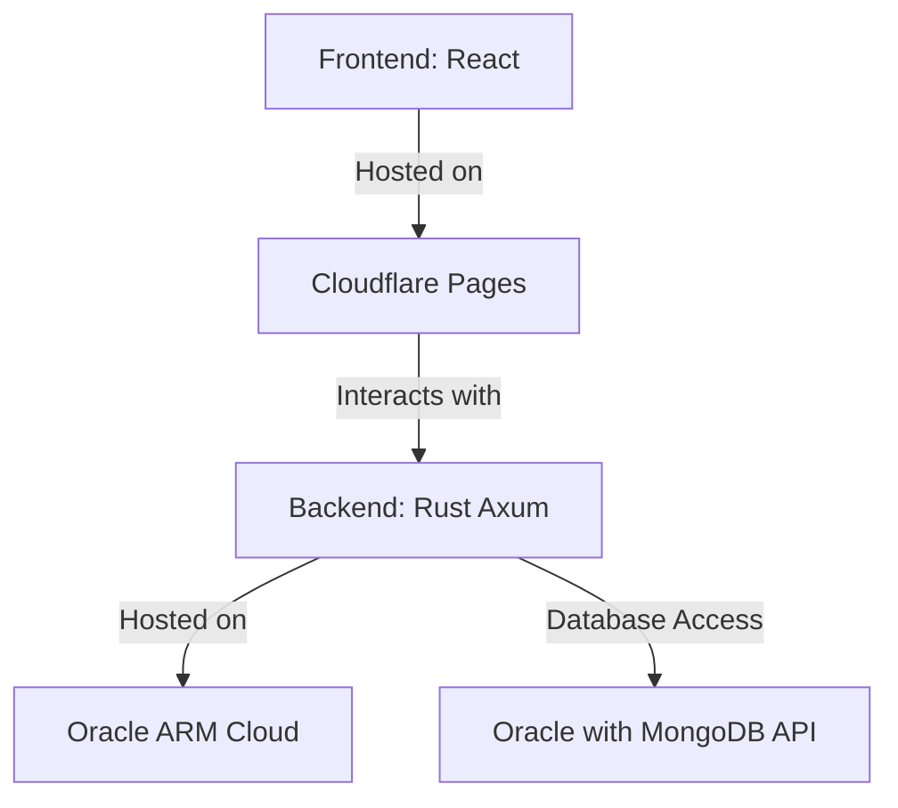

This is not a dev repo, it is a summary repo.

See the code in [Front-end](https://github.com/investutil/investutil-front-public), [Back-end](https://github.com/investutil/investutil-back-public), [gocrawler](https://github.com/investutil/gocrawler) repos
## Introduction
Welcome to the InvestUtil project repository. This repository contains information about my site, which I plan to partially open-source. The project aims to provide a comprehensive investment utility platform. For the initial setup and development, I plan to use this guide.

## children repo

### public repo
#### Front-end
https://github.com/investutil/investutil-front-public
#### Back-end
https://github.com/investutil/investutil-back-public
#### Web Scrapping
https://github.com/investutil/gocrawler

## Domain Name
### Site
www.investutil.com
### Documentations
doc.investutil.com
### Blog
blog.investutil.com
### Tech Wiki
https://github.com/investutil/investutil-principal/wiki

## Tech Stack

### Frontend

- Library: React
- Hosting: Cloudflare Pages
- Anti-Scraping Bot: Fight Mode
  
### Backend
- Framework: Rust Axum
- Hosting: Oracle ARM Cloud
### Database
- Type: MongoDB
- Rust connection: MongoDB Rust Driver

### CICD
GitHub Actions 

### Docker registry
GitHub Container Registry

### Documentation
- mdBook

### Blog
- getzola
### Production Deployment
The deployment process for the InvestUtil project involves using Cloudflare Pages for the frontend, Oracle ARM Cloud for the backend, and Cloudflare D1 for the database. This section will be updated with detailed deployment instructions as the project progresses.

#### Diagram
Below is a diagram illustrating the architecture and tech stack of the InvestUtil project:

### Development Environment Setup
WSL2 Ubuntu, React + Rust Axum + mongodb atlas free plan

### DevOps Tools and Services

- **Version Control:** GitHub (private repo)
- **CI/CD Pipeline:** GitHub Actions
- **Code Quality:** SonarCloud
- Code Formatting:
  -React: Prettier
  -Rust: rustfmt
- **Testing:** 
  - Unit and Integration Tests:
    - Jest for React
    - Rust (Axum): Built-in Rust test framework and additional libraries
  - End-to-End Tests: Cypress or Playwright
  - Database Tests: MongoDB Rust Driver
- **Deployment:**
  - **Nightly Builds:** Automated nightly builds using GitHub Actions
  - **Pre-production:** Similar setup as production, hosted on a staging server
  - **Production:** Cloudflare Pages (for frontend), Oracle ARM Cloud (for backend), Oracle with MongoDB API (for database)
